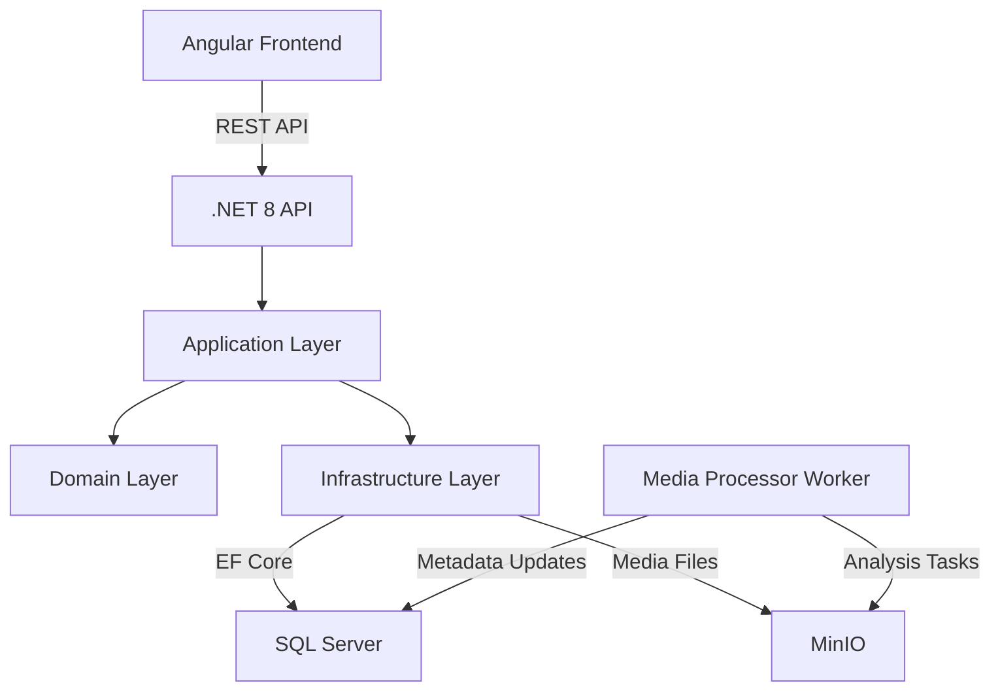

# 🎵 Music Learning Library

[](https://dotnet.microsoft.com/)
[](https://angular.io/)
[](https://www.docker.com/)
[](https://min.io/)
[](https://www.docker.com/)
[]()

---

## 📖 Product Overview

**Music Learning Library** is a full-stack application designed to go beyond traditional music players and media managers.

The platform allows users to **upload their own music** and not only manage it, but also **learn how to play it** by providing structured musical information and analysis.

The project combines:
- media storage and management  
- musical feature extraction  
- learning-oriented workflows  

into a single, scalable system.

At its current stage, the core media pipeline is already implemented, while the application is now evolving toward **music analysis and learning features**.

---

## 🎯 Product Vision

The main goal of Music Learning Library is to transform passive listening into **active learning**.

Users should be able to:
- upload a song they want to learn
- understand its musical properties (tempo, key, chords, melody)
- use this information to practice, study, and improve their musical skills

The application is intentionally designed to support future extensions such as advanced analysis algorithms and AI-assisted music understanding.

---

## 🧱 Current State of the Project

The project is fully functional as a **media management system** and provides a solid technical foundation for the learning features currently under development.

### ✅ Implemented
- Media upload workflow
- Media listing
- Object storage via **MinIO**
- Metadata persistence in **SQL Server**
- Background worker service for media processing
- Clean Architecture backend built with **.NET 8**
- Angular frontend integration
- Docker Compose–based infrastructure

---

## ✨ Features

### 🎶 Media Management (Implemented)
- Upload audio files
- Store files in MinIO object storage
- Persist metadata in a relational database
- List uploaded media items
- Background processing support

### 🎼 Music Learning & Analysis (Planned / In Progress)
- BPM (tempo) detection
- Key and tonality recognition
- Chord detection
- Melody note extraction
- Song structure analysis
- Learning-oriented views for practice and repetition

---

## 🛠️ Technology Stack

| Layer | Technology |
|------|------------|
| Backend | .NET 8 Web API |
| Architecture | Clean Architecture |
| Frontend | Angular |
| Database | Microsoft SQL Server (Docker) |
| ORM | Entity Framework Core |
| Object Storage | MinIO |
| Background Processing | .NET Worker Service |
| DevOps | Docker, Docker Compose |
| Version Control | Git & GitHub |

---

## 🏗️ High-Level Architecture


---

## 📡 API Capabilities

### ✔️ Implemented

#### <kbd>POST /api/media/upload</kbd>
- Uploads a media file
- Stores the file in MinIO
- Persists metadata in the database

#### <kbd>GET /api/media</kbd>
Returns the list of uploaded media items.

---

## 🏗️ Planned (Music Learning APIs)

#### <kbd>GET /api/media/{id}/analysis</kbd>
- Returns BPM, key, chords, and melody data.

#### <kbd>GET /api/media/{id}/structure</kbd>
- Returns song sections and timing.

#### <kbd>GET /api/media/{id}/practice</kbd>
- Provides learning-oriented data for practicing the song.

---

## 🖼️ Screenshots

Screenshots will be added as the frontend evolves.

---

## ⚡ Internal Development setup

> ⚠️ This section is intended for authorized developers only.

#### 1. Clone the repository
```bash
git clone https://github.com/Mbazie-Kone/MusicLearningLibrary.git
```
#### 2. Start application via Docker
```bash
docker compose up --build -d
```
#### 3. Apply EF Core migrations
```bash
dotnet ef database update -p MusicLearningLibrary.Infrastructure -s MusicLearningLibrary.Api
```
#### 4. Run the API
```
cd MusicLearningLibrary.Api
dotnet run
```
---

## 🚀 Roadmap

 - Audio feature extraction (BPM, key)

 - Chord detection pipeline

 - Melody note extraction

 - Music learning domain models

 - Learning-oriented frontend views

 - User practice tracking

 - Authentication & user profiles

 - AI-assisted music analysis
 
 ---

## 🧭 Internal Git Workflow

- `main` is protected and represents production-ready code
- `develop` is the integration branch
- Feature branches must be created from `develop`
- Merges into `develop` use Squash
- Merges into `main` use Squash and Merge
- `node_modules` must never be committed
- Conflicts must be resolved locally, not via GitHub UI

---